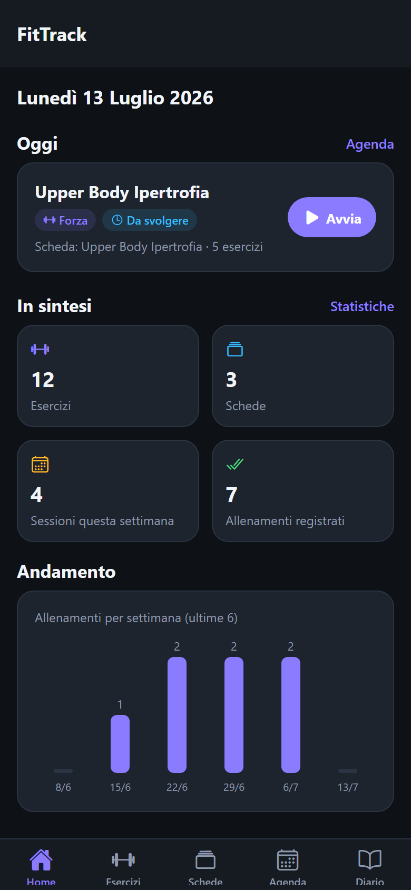
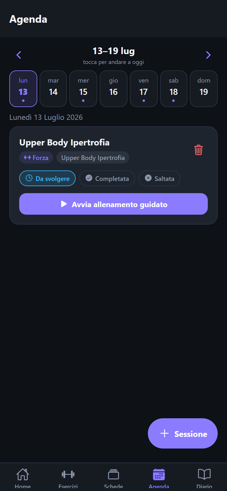
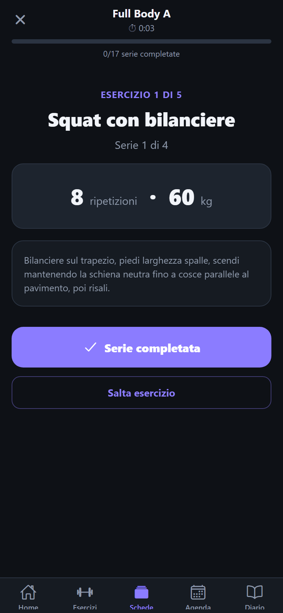

# FitTrack – Fitness & Workout Tracker

App mobile per organizzare esercizi, schede di allenamento, sessioni pianificate, diario degli allenamenti svolti e obiettivi personali.

Progetto per il corso di **Mobile Programming** (Traccia #2 – Fitness & Workout Tracker App), sviluppato in **React Native** con **Expo**.

<p align="center">
  
  
  
</p>

## Funzionalità

- **Esercizi** – elenco, dettaglio, creazione, modifica ed eliminazione; ricerca per nome e filtri per gruppo muscolare e difficoltà.
- **Schede di allenamento** – CRUD completo; per ogni esercizio si impostano serie, ripetizioni, recupero, carico e ordine; ricerca e filtro per obiettivo.
- **Agenda** – pianificazione settimanale delle sessioni con stato *da svolgere / completata / saltata*, collegamento a una scheda.
- **Diario** – registrazione degli allenamenti svolti (serie, ripetizioni, carichi, durata, fatica percepita), filtri per periodo e **confronto tra due allenamenti**.
- **Obiettivi** – creazione e monitoraggio; per le categorie *frequenza* e *durata* l'avanzamento viene calcolato automaticamente dal diario.
- **Statistiche** – riepiloghi, grafici sugli allenamenti per settimana, distribuzione degli esercizi per gruppo muscolare, sessioni pianificate vs completate.

### Feature avanzate

- **Allenamento guidato con timer** – esegue una scheda passo passo (esercizio per esercizio, serie per serie) con timer di recupero automatico; al termine salva l'allenamento nel diario e marca la sessione come completata.
- **Duplicazione** – di una scheda (dall'elenco o dal dettaglio) e di una sessione (alla settimana successiva).
- **Confronto allenamenti** – metriche complessive e volume/carico massimo per gli esercizi in comune.

I dati sono salvati in **persistenza locale** (AsyncStorage): l'app funziona completamente offline. Al primo avvio vengono caricati dati dimostrativi (ripristinabili da Home → *Ripristina dati demo*).

## Requisiti

- [Node.js](https://nodejs.org/) LTS (≥ 20) con npm
- Per provare l'app su telefono: app **Expo Go** ([Android](https://play.google.com/store/apps/details?id=host.exp.exponent) / [iOS](https://apps.apple.com/app/expo-go/id982107779))
- In alternativa: un emulatore Android (Android Studio) o il browser

## Installazione

```bash
git clone <url-del-repository>
cd FitTrack
npm install
```

## Avvio

```bash
npx expo start
```

Poi:

- **Telefono (consigliato per la demo)**: inquadrare il QR code mostrato nel terminale con l'app Expo Go (Android) o con la fotocamera (iOS). Telefono e PC devono essere sulla stessa rete Wi-Fi; in caso di problemi usare `npx expo start --tunnel`.
- **Emulatore Android**: premere `a` nel terminale (serve Android Studio con un emulatore configurato).
- **Browser**: premere `w` nel terminale (versione web, utile per uno sguardo rapido).

## Struttura del progetto

```
FitTrack/
├── App.js                     # Entry point: provider di stato + navigazione
├── index.js
├── app.json                   # Configurazione Expo (icone, splash, package Android)
├── eas.json                   # Profili di build EAS (APK con il profilo "preview")
├── resources/                 # Icona app, icona adattiva Android, splash screen
├── src/
│   ├── theme.js               # Palette colori, spaziature, raggi
│   ├── constants.js           # Vocabolari di dominio (gruppi muscolari, difficoltà, …)
│   ├── data/seed.js           # Dati dimostrativi (date relative a "oggi")
│   ├── state/AppContext.js    # Store globale: Context + useReducer + AsyncStorage
│   ├── utils/                 # Date, id, statistiche, conferme cross-platform
│   ├── components/            # Componenti riutilizzabili (UI, form, grafici, picker)
│   ├── navigation/RootNavigator.js  # 5 tab, ognuna con il proprio stack
│   └── screens/               # 17 schermate raggruppate per dominio
│       ├── HomeScreen.js, StatsScreen.js
│       ├── exercises/  (lista, dettaglio, form)
│       ├── plans/      (lista, dettaglio, form)
│       ├── planner/    (agenda, form sessione)
│       ├── logs/       (diario, dettaglio, form, confronto)
│       ├── goals/      (lista, form)
│       └── workout/    (allenamento guidato con timer)
└── docs/screenshots/          # Screenshot dell'app
```

## Build dell'APK (Android)

Le risorse grafiche (icona, icona adattiva, splash screen) si trovano in `resources/` e sono già collegate in `app.json`.

**Con EAS Build (consigliato, non richiede Android Studio):**

```bash
npm install -g eas-cli
eas login                                # serve un account Expo gratuito
eas build -p android --profile preview   # produce un APK installabile
```

Il profilo `preview` definito in `eas.json` genera direttamente un `.apk` (invece di un `.aab`), scaricabile dal link mostrato a fine build.

**In alternativa, build locale (richiede Android Studio / Android SDK):**

```bash
npx expo prebuild -p android
cd android
./gradlew assembleRelease
# APK in android/app/build/outputs/apk/release/
```

## Stack tecnologico

| Ambito | Scelta |
| --- | --- |
| Framework | React Native 0.81 + Expo SDK 54 |
| Navigazione | React Navigation 7 (bottom tabs + native stack) |
| Stato | React Context + `useReducer` |
| Persistenza | `@react-native-async-storage/async-storage` |
| Icone | `@expo/vector-icons` (Ionicons) |
| Grafici | Componenti custom realizzati con `View` (nessuna libreria esterna) |

## Note

- Non è richiesto alcun backend: tutti i dati sono locali al dispositivo.
- I dati dimostrativi usano date relative al giorno corrente, così la demo è sempre "attuale".
- La relazione tecnica e le slide di presentazione si trovano nella cartella di consegna insieme al progetto.
